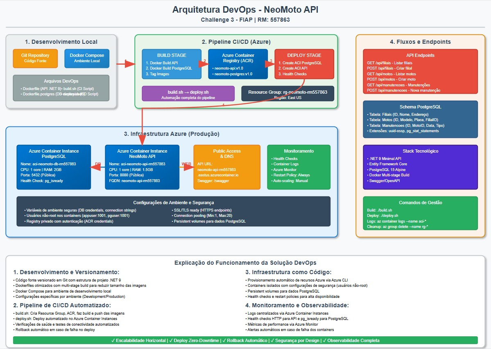

# NeoMoto API - DevOps Challenge 3

## Descrição da Solução

NeoMoto é uma API RESTful para gestão da frota da Mottu (motos), organizada por filiais e com histórico de manutenções. Desenvolvida com .NET 9 Minimal API e PostgreSQL, containerizada com Docker e deployada na nuvem Azure usando Azure Container Registry (ACR) + Azure Container Instances (ACI).

## Benefícios para o Negócio

### Problemas Resolvidos:

- **Gestão Centralizada**: Controle unificado de toda a frota de motos distribuída em múltiplas filiais
- **Rastreabilidade**: Histórico completo de manutenções para cada veículo, permitindo análises de custo e performance
- **Escalabilidade**: Arquitetura em nuvem que permite crescimento conforme demanda
- **Disponibilidade**: Deploy em containers garante alta disponibilidade e facilidade de manutenção

### Melhorias Trazidas:

- **Redução de Custos**: Melhor planejamento de manutenções preventivas
- **Eficiência Operacional**: Consultas rápidas e paginadas para grandes volumes de dados
- **Tomada de Decisão**: Relatórios e estatísticas em tempo real
- **Integração**: HATEOAS permite navegação intuitiva entre recursos relacionados

## Tecnologias

- .NET 9.0 (Minimal API)
- Entity Framework Core 8.0
- PostgreSQL 15
- Docker e Azure Container Registry
- Azure Container Instances
- Swagger/OpenAPI

## CRUD Completo Implementado

### Filiais

- `GET /api/filiais` - Listar filiais (com paginação)
- `GET /api/filiais/{id}` - Buscar filial por ID
- `POST /api/filiais` - Criar nova filial
- `PUT /api/filiais/{id}` - Atualizar filial
- `DELETE /api/filiais/{id}` - Deletar filial

### Motos

- `GET /api/motos` - Listar motos (com paginação)
- `GET /api/motos/{id}` - Buscar moto por ID
- `POST /api/motos` - Criar nova moto
- `PUT /api/motos/{id}` - Atualizar moto
- `DELETE /api/motos/{id}` - Deletar moto

### Manutenções

- `GET /api/manutencoes` - Listar manutenções (com paginação)
- `GET /api/manutencoes/{id}` - Buscar manutenção por ID
- `POST /api/manutencoes` - Criar nova manutenção
- `PUT /api/manutencoes/{id}` - Atualizar manutenção
- `DELETE /api/manutencoes/{id}` - Deletar manutenção

## Banco de Dados na Nuvem

- **PostgreSQL 15** rodando em Azure Container Instance
- **Localização**: East US
- **Recursos**: 1 CPU, 2GB RAM
- **Dados de Exemplo**: Mais de 2 registros em cada tabela para demonstração

## 🚀 Como Rodar a Aplicação

### Pré-requisitos

- Azure CLI instalado e configurado
- Docker Desktop instalado e rodando
- Conta Azure ativa

### Deploy Rápido (3 comandos)

```bash
# 1. Login no Azure
az login

# 2. Build e Push para ACR
./build.sh

# 3. Deploy no ACI
./deploy.sh
```

### Verificar Deploy

```bash
# Ver status dos containers
az container list --resource-group rg-neomoto-rm557863 --output table
```

### URLs da Aplicação

- **API Base**: `http://neomoto-api-rm557863.eastus.azurecontainer.io:8080`
- **Swagger UI**: `http://neomoto-api-rm557863.eastus.azurecontainer.io:8080/swagger`

## 🧪 COMO TESTAR A APLICAÇÃO

### Teste Rápido

**Para Linux/Mac (curl):**

```bash
# Testar se API está respondendo
curl http://neomoto-api-rm557863.eastus.azurecontainer.io:8080/api/filiais
```

**Para Windows PowerShell:**

```powershell
# Testar se API está respondendo
Invoke-RestMethod -Uri "http://neomoto-api-rm557863.eastus.azurecontainer.io:8080/api/filiais" -Method GET
```

### Teste CRUD Completo

## API de Filiais

**1. Criar Filial (POST)**

**Linux/Mac (curl):**

```bash
curl -X POST http://neomoto-api-rm557863.eastus.azurecontainer.io:8080/api/filiais \
  -H "Content-Type: application/json" \
  -d '{"nome":"Filial Teste","endereco":"Rua Teste 123","cidade":"São Paulo","uf":"SP"}'
```

**Windows PowerShell:**

```powershell
Invoke-RestMethod -Uri "http://neomoto-api-rm557863.eastus.azurecontainer.io:8080/api/filiais" -Method POST -ContentType "application/json" -Body '{"nome":"Filial Teste","endereco":"Rua Teste 123","cidade":"São Paulo","uf":"SP"}'
```

**Resposta esperada:**

```json
{
  "id": "9560ad19-183a-4e3b-aa99-88663dff367a",
  "nome": "Filial Teste",
  "endereco": "Rua Teste 123",
  "cidade": "São Paulo",
  "uf": "SP",
  "_links": {
    "self": "/api/filiais/9560ad19-183a-4e3b-aa99-88663dff367a"
  }
}
```

**2. Listar Filiais (GET)**

**Linux/Mac (curl):**

```bash
# Listar todas as filiais
curl http://neomoto-api-rm557863.eastus.azurecontainer.io:8080/api/filiais

# Listar com paginação (página 1, 10 itens por página)
curl "http://neomoto-api-rm557863.eastus.azurecontainer.io:8080/api/filiais?pageNumber=1&pageSize=10"
```

**Windows PowerShell:**

```powershell
# Listar todas as filiais
Invoke-RestMethod -Uri "http://neomoto-api-rm557863.eastus.azurecontainer.io:8080/api/filiais" -Method GET

# Listar com paginação
Invoke-RestMethod -Uri "http://neomoto-api-rm557863.eastus.azurecontainer.io:8080/api/filiais?pageNumber=1&pageSize=10" -Method GET
```

**3. Buscar Filial por ID (GET)**

**Linux/Mac (curl):**

```bash
curl http://neomoto-api-rm557863.eastus.azurecontainer.io:8080/api/filiais/[ID_DA_FILIAL]
```

**Windows PowerShell:**

```powershell
Invoke-RestMethod -Uri "http://neomoto-api-rm557863.eastus.azurecontainer.io:8080/api/filiais/[ID_DA_FILIAL]" -Method GET
```

**4. Atualizar Filial (PUT)**

**Linux/Mac (curl):**

```bash
curl -X PUT http://neomoto-api-rm557863.eastus.azurecontainer.io:8080/api/filiais/[ID_DA_FILIAL] \
  -H "Content-Type: application/json" \
  -d '{"nome":"Filial Atualizada","endereco":"Rua Atualizada 456","cidade":"Rio de Janeiro","uf":"RJ"}'
```

**Windows PowerShell:**

```powershell
Invoke-RestMethod -Uri "http://neomoto-api-rm557863.eastus.azurecontainer.io:8080/api/filiais/[ID_DA_FILIAL]" -Method PUT -ContentType "application/json" -Body '{"nome":"Filial Atualizada","endereco":"Rua Atualizada 456","cidade":"Rio de Janeiro","uf":"RJ"}'
```

**5. Deletar Filial (DELETE)**

**Linux/Mac (curl):**

```bash
curl -X DELETE http://neomoto-api-rm557863.eastus.azurecontainer.io:8080/api/filiais/[ID_DA_FILIAL]
```

**Windows PowerShell:**

```powershell
Invoke-RestMethod -Uri "http://neomoto-api-rm557863.eastus.azurecontainer.io:8080/api/filiais/[ID_DA_FILIAL]" -Method DELETE
```

## API de Motos

**1. Criar Moto (POST)**

**Linux/Mac (curl):**

```bash
# IMPORTANTE: Use o ID retornado na criação da filial
curl -X POST http://neomoto-api-rm557863.eastus.azurecontainer.io:8080/api/motos \
  -H "Content-Type: application/json" \
  -d '{"placa":"TEST123","modelo":"Honda CG 160","ano":2024,"filialId":"[ID_DA_FILIAL]"}'

# Exemplo com GUID real:
# curl -X POST http://neomoto-api-rm557863.eastus.azurecontainer.io:8080/api/motos \
#   -H "Content-Type: application/json" \
#   -d '{"placa":"TEST123","modelo":"Honda CG 160","ano":2024,"filialId":"12345678-1234-1234-1234-123456789012"}'
```

**Windows PowerShell:**

```powershell
# IMPORTANTE: Use o ID retornado na criação da filial
Invoke-RestMethod -Uri "http://neomoto-api-rm557863.eastus.azurecontainer.io:8080/api/motos" -Method POST -ContentType "application/json" -Body '{"placa":"TEST123","modelo":"Honda CG 160","ano":2024,"filialId":"[ID_DA_FILIAL]"}'
```

**2. Listar Motos (GET)**

**Linux/Mac (curl):**

```bash
# Listar todas as motos
curl http://neomoto-api-rm557863.eastus.azurecontainer.io:8080/api/motos

# Listar com paginação
curl "http://neomoto-api-rm557863.eastus.azurecontainer.io:8080/api/motos?pageNumber=1&pageSize=10"

# Listar motos de uma filial específica
curl "http://neomoto-api-rm557863.eastus.azurecontainer.io:8080/api/filiais/[ID_DA_FILIAL]/motos"
```

**Windows PowerShell:**

```powershell
# Listar todas as motos
Invoke-RestMethod -Uri "http://neomoto-api-rm557863.eastus.azurecontainer.io:8080/api/motos" -Method GET

# Listar com paginação
Invoke-RestMethod -Uri "http://neomoto-api-rm557863.eastus.azurecontainer.io:8080/api/motos?pageNumber=1&pageSize=10" -Method GET

# Listar motos de uma filial específica
Invoke-RestMethod -Uri "http://neomoto-api-rm557863.eastus.azurecontainer.io:8080/api/filiais/[ID_DA_FILIAL]/motos" -Method GET
```

**3. Buscar Moto por ID (GET)**

**Linux/Mac (curl):**

```bash
curl http://neomoto-api-rm557863.eastus.azurecontainer.io:8080/api/motos/[ID_DA_MOTO]
```

**Windows PowerShell:**

```powershell
Invoke-RestMethod -Uri "http://neomoto-api-rm557863.eastus.azurecontainer.io:8080/api/motos/[ID_DA_MOTO]" -Method GET
```

**4. Atualizar Moto (PUT)**

**Linux/Mac (curl):**

```bash
curl -X PUT http://neomoto-api-rm557863.eastus.azurecontainer.io:8080/api/motos/[ID_DA_MOTO] \
  -H "Content-Type: application/json" \
  -d '{"placa":"UPD123","modelo":"Yamaha Fazer 250","ano":2023,"filialId":"[ID_DA_FILIAL]"}'
```

**Windows PowerShell:**

```powershell
Invoke-RestMethod -Uri "http://neomoto-api-rm557863.eastus.azurecontainer.io:8080/api/motos/[ID_DA_MOTO]" -Method PUT -ContentType "application/json" -Body '{"placa":"UPD123","modelo":"Yamaha Fazer 250","ano":2023,"filialId":"[ID_DA_FILIAL]"}'
```

**5. Deletar Moto (DELETE)**

**Linux/Mac (curl):**

```bash
curl -X DELETE http://neomoto-api-rm557863.eastus.azurecontainer.io:8080/api/motos/[ID_DA_MOTO]
```

**Windows PowerShell:**

```powershell
Invoke-RestMethod -Uri "http://neomoto-api-rm557863.eastus.azurecontainer.io:8080/api/motos/[ID_DA_MOTO]" -Method DELETE
```

## API de Manutenções

**1. Criar Manutenção (POST)**

**Linux/Mac (curl):**

```bash
# IMPORTANTE: Use o ID retornado na criação da moto
curl -X POST http://neomoto-api-rm557863.eastus.azurecontainer.io:8080/api/manutencoes \
  -H "Content-Type: application/json" \
  -d '{"motoId":"[ID_DA_MOTO]","data":"2024-09-24T10:30:00Z","descricao":"Troca de óleo","custo":99.99}'

# Exemplo com GUID real:
# curl -X POST http://neomoto-api-rm557863.eastus.azurecontainer.io:8080/api/manutencoes \
#   -H "Content-Type: application/json" \
#   -d '{"motoId":"12345678-1234-1234-1234-123456789012","data":"2024-09-24T10:30:00Z","descricao":"Troca de óleo","custo":99.99}'
```

**Windows PowerShell:**

```powershell
# IMPORTANTE: Use o ID retornado na criação da moto
Invoke-RestMethod -Uri "http://neomoto-api-rm557863.eastus.azurecontainer.io:8080/api/manutencoes" -Method POST -ContentType "application/json" -Body '{"motoId":"[ID_DA_MOTO]","data":"2024-09-24T10:30:00Z","descricao":"Troca de óleo","custo":99.99}'
```

**2. Listar Manutenções (GET)**

**Linux/Mac (curl):**

```bash
# Listar todas as manutenções
curl http://neomoto-api-rm557863.eastus.azurecontainer.io:8080/api/manutencoes

# Listar com paginação
curl "http://neomoto-api-rm557863.eastus.azurecontainer.io:8080/api/manutencoes?pageNumber=1&pageSize=10"

# Listar manutenções de uma moto específica
curl "http://neomoto-api-rm557863.eastus.azurecontainer.io:8080/api/motos/[ID_DA_MOTO]/manutencoes"
```

**Windows PowerShell:**

```powershell
# Listar todas as manutenções
Invoke-RestMethod -Uri "http://neomoto-api-rm557863.eastus.azurecontainer.io:8080/api/manutencoes" -Method GET

# Listar com paginação
Invoke-RestMethod -Uri "http://neomoto-api-rm557863.eastus.azurecontainer.io:8080/api/manutencoes?pageNumber=1&pageSize=10" -Method GET

# Listar manutenções de uma moto específica
Invoke-RestMethod -Uri "http://neomoto-api-rm557863.eastus.azurecontainer.io:8080/api/motos/[ID_DA_MOTO]/manutencoes" -Method GET
```

**3. Buscar Manutenção por ID (GET)**

**Linux/Mac (curl):**

```bash
curl http://neomoto-api-rm557863.eastus.azurecontainer.io:8080/api/manutencoes/[ID_DA_MANUTENCAO]
```

**Windows PowerShell:**

```powershell
Invoke-RestMethod -Uri "http://neomoto-api-rm557863.eastus.azurecontainer.io:8080/api/manutencoes/[ID_DA_MANUTENCAO]" -Method GET
```

**4. Atualizar Manutenção (PUT)**

**Linux/Mac (curl):**

```bash
curl -X PUT http://neomoto-api-rm557863.eastus.azurecontainer.io:8080/api/manutencoes/[ID_DA_MANUTENCAO] \
  -H "Content-Type: application/json" \
  -d '{"motoId":"[ID_DA_MOTO]","data":"2024-09-25T14:00:00Z","descricao":"Revisão completa","custo":250.00}'
```

**Windows PowerShell:**

```powershell
Invoke-RestMethod -Uri "http://neomoto-api-rm557863.eastus.azurecontainer.io:8080/api/manutencoes/[ID_DA_MANUTENCAO]" -Method PUT -ContentType "application/json" -Body '{"motoId":"[ID_DA_MOTO]","data":"2024-09-25T14:00:00Z","descricao":"Revisão completa","custo":250.00}'
```

**5. Deletar Manutenção (DELETE)**

**Linux/Mac (curl):**

```bash
curl -X DELETE http://neomoto-api-rm557863.eastus.azurecontainer.io:8080/api/manutencoes/[ID_DA_MANUTENCAO]
```

**Windows PowerShell:**

```powershell
Invoke-RestMethod -Uri "http://neomoto-api-rm557863.eastus.azurecontainer.io:8080/api/manutencoes/[ID_DA_MANUTENCAO]" -Method DELETE
```

## Troubleshooting - Problemas Comuns

### ❌ **Erro: "Parâmetros de paginação inválidos"**

- **Causa**: Usar `page` em vez de `pageNumber`
- **Solução**: Use `pageNumber=1&pageSize=10` em vez de `page=1&pageSize=10`

### ❌ **Erro: "Filial inexistente" ou "Moto inexistente"**

- **Causa**: Usar ID inválido ou não existente
- **Solução**:
  1. Primeiro crie a filial e copie o ID retornado
  2. Use esse ID para criar a moto
  3. Use o ID da moto para criar manutenções

### ❌ **Erro: "Placa já cadastrada"**

- **Causa**: Tentando criar moto com placa que já existe
- **Solução**: Use uma placa diferente (ex: TEST124, TEST125, etc.)

### ❌ **Erro: "Id do corpo difere do parâmetro"**

- **Causa**: No PUT, o ID na URL deve ser igual ao ID no JSON
- **Solução**: Certifique-se que ambos os IDs são iguais

### ✅ **Como obter IDs corretos:**

```bash
# 1. Criar filial e capturar ID
FILIAL_RESPONSE=$(curl -s -X POST http://neomoto-api-rm557863.eastus.azurecontainer.io:8080/api/filiais \
  -H "Content-Type: application/json" \
  -d '{"nome":"Filial Demo","endereco":"Av. Demo 123","cidade":"São Paulo","uf":"SP"}')
echo "Resposta da filial: $FILIAL_RESPONSE"

# 2. Extrair ID (se tiver jq instalado)
FILIAL_ID=$(echo $FILIAL_RESPONSE | jq -r '.id')
echo "ID da filial: $FILIAL_ID"
```

## Teste de Sequência Completa

**Exemplo de fluxo completo:**

```bash
# 1. Criar filial
FILIAL_ID=$(curl -s -X POST http://neomoto-api-rm557863.eastus.azurecontainer.io:8080/api/filiais \
  -H "Content-Type: application/json" \
  -d '{"nome":"Filial Demo","endereco":"Av. Demo 123","cidade":"São Paulo","uf":"SP"}' | jq -r '.id')

# 2. Criar moto na filial
MOTO_ID=$(curl -s -X POST http://neomoto-api-rm557863.eastus.azurecontainer.io:8080/api/motos \
  -H "Content-Type: application/json" \
  -d "{\"placa\":\"DEMO123\",\"modelo\":\"Honda CG 160\",\"ano\":2024,\"filialId\":\"$FILIAL_ID\"}" | jq -r '.id')

# 3. Criar manutenção na moto
MANUTENCAO_ID=$(curl -s -X POST http://neomoto-api-rm557863.eastus.azurecontainer.io:8080/api/manutencoes \
  -H "Content-Type: application/json" \
  -d "{\"motoId\":\"$MOTO_ID\",\"data\":\"2024-09-24T10:30:00Z\",\"descricao\":\"Manutenção inicial\",\"custo\":150.00}" | jq -r '.id')

# 4. Listar tudo criado
echo "Filial criada: $FILIAL_ID"
echo "Moto criada: $MOTO_ID"
echo "Manutenção criada: $MANUTENCAO_ID"

# 5. Verificar dados
curl http://neomoto-api-rm557863.eastus.azurecontainer.io:8080/api/filiais/$FILIAL_ID
curl http://neomoto-api-rm557863.eastus.azurecontainer.io:8080/api/motos/$MOTO_ID
curl http://neomoto-api-rm557863.eastus.azurecontainer.io:8080/api/manutencoes/$MANUTENCAO_ID
```

## Arquitetura da Solução



A imagem acima ilustra a arquitetura DevOps completa da solução NeoMoto API, detalhando o fluxo desde o desenvolvimento local até a implantação e monitoramento em ambiente Azure.

**Principais Componentes:**

- **Desenvolvimento Local:** Utiliza Git para versionamento e Docker Compose para um ambiente de desenvolvimento consistente
- **Pipeline CI/CD (Azure):** Automatiza o processo de build (Docker Build da API e PostgreSQL), armazenamento de imagens no Azure Container Registry (ACR) e deploy no Azure Container Instances (ACI)
- **Infraestrutura Azure (Produção):** A aplicação é executada em Azure Container Instances, com containers para API (.NET 9) e PostgreSQL, incluindo monitoramento e configurações de segurança
- **Fluxos e Endpoints:** Detalha os endpoints da API para gestão de filiais, motos e manutenções, o schema do banco de dados PostgreSQL e a stack tecnológica utilizada

## Arquitetura na Azure

```
Azure Resource Group (rg-neomoto-rm557863)
├── Azure Container Registry (acrneomotorm557863)
│   ├── neomoto-api:v1.0
│   └── neomoto-postgres:v1.0
└── Azure Container Instances
    ├── aci-neomoto-db-rm557863 (PostgreSQL)
    └── aci-neomoto-api-rm557863 (API .NET)
```

## Comandos de Monitoramento

```bash
# Ver status dos containers
az container list --resource-group rg-neomoto-rm557863 --output table

# Ver logs da API
az container logs --resource-group rg-neomoto-rm557863 --name aci-neomoto-api-rm557863

# Ver logs do banco
az container logs --resource-group rg-neomoto-rm557863 --name aci-neomoto-db-rm557863

# DELETAR TODOS OS RECURSOS
az group delete --name rg-neomoto-rm557863 --yes --no-wait
```

## Segurança Implementada

- **Container não-root**: Aplicação roda com usuário `appuser` (UID 1001)
- **Imagens oficiais**: Microsoft .NET e PostgreSQL oficiais
- **Health checks**: Monitoramento automático da saúde dos containers

## Estrutura do Projeto

```
ProjetoNetMottu/
├── Dockerfile                  # Container da API .NET
├── Dockerfile.postgres         # Container PostgreSQL customizado
├── build.sh                    # Script de build para ACR
├── deploy.sh                   # Script de deploy para ACI
├── script_bd.sql              # DDL completo do banco
├── NeoMoto.Api/                # API principal
├── NeoMoto.Domain/             # Entidades do domínio
├── NeoMoto.Infrastructure/     # DbContext e configurações EF
└── NeoMoto.Tests/              # Testes automatizados
```

## Integrantes do Projeto

- **Afonso Correia Pereira** - RM557863
- **Adel Mouhaidly** - RM557705
- **Tiago Augusto Desiderato** - RM558485

##  Resumo dos Comandos

```bash
# Deploy completo
git clone [REPO_URL]
cd DevopsChallenge3-NeoMoto/ProjetoNetMottu
az login
./build.sh
./deploy.sh

# Teste
curl http://neomoto-api-rm557863.eastus.azurecontainer.io:8080/api/filiais

# Limpeza
az group delete --name rg-neomoto-rm557863 --yes --no-wait
```
